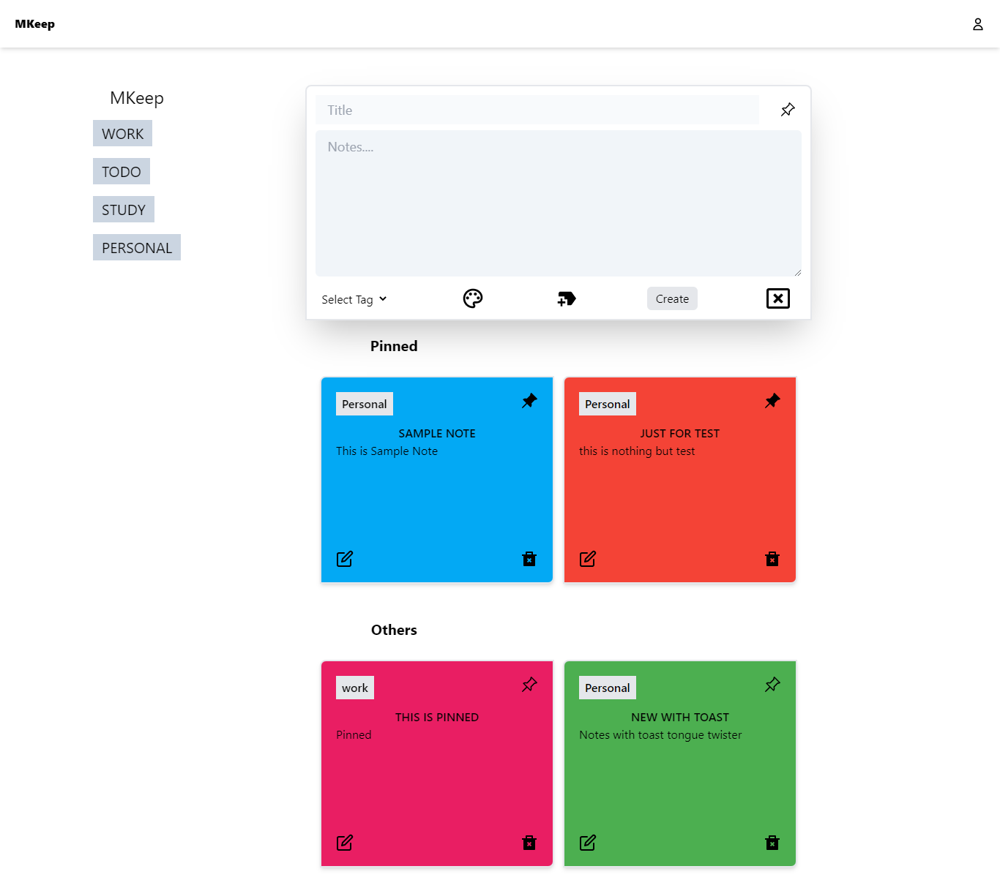

# MKeep
 Note Taking App
Deployed app: [https://mkeep.netlify.app/](https://mkeep.netlify.app/)

#Home Page


### Tech Stack: 
- **React.js** : v17.0.2
- **React router**: v6.2.1
- **Express**
- **Axios** : v0.25.0
- **Tailwind**: v3.0.18
- **Reduxjs/toolkit**: v1.7.2

### Features
1.  Create a note
2.  Edit note
3.  Auth: Log in and Sign up
4.  Private and public routes: Private routes accessible only on login
5.  Pin the note /unpin the note
6.  Edit Note
7.  Remove Note
8.  Responsive design
9.  Local storage persistence of auth state with Jwt
10. Add Labels

Bootstrapped with `create-react-app`

## Run Locally

#### Get started

1. **Clone the repo:**
```bash
  $ git clone https://github.com/KuldeepSinghRathore/MKeep.git
```
2. **Install required node modules:**
```bash
  $ npm install
```
3. **Start the dev server:**
```bash
  $ npm start
```
Open the `localhost` link in the browser.
Happy hacking!       


## 🔗 Links
[](https://twitter.com/__Kuldeep_Singh)

[](https://www.linkedin.com/in/kuldeep--singh/)